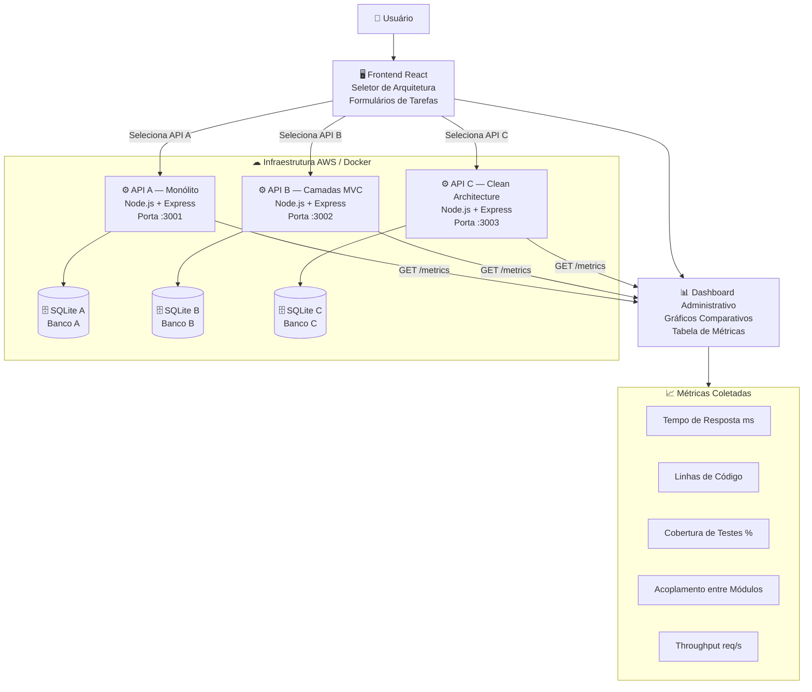

```mermaid
---
id: eb8fde65-50cc-449b-b4b0-e85a8e81450e
---
flowchart TD
    U["👤 Usuário"] --> FE["🖥 Frontend React<br/>Seletor de Arquitetura<br/>Formulários de Tarefas"]
 
    FE --> DASH["📊 Dashboard Administrativo<br/>Gráficos Comparativos<br/>Tabela de Métricas"]
 
    FE -->|Seleciona API A| A["⚙ API A — Monólito<br/>Node.js + Express<br/>Porta :3001"]
    FE -->|Seleciona API B| B["⚙ API B — Camadas MVC<br/>Node.js + Express<br/>Porta :3002"]
    FE -->|Seleciona API C| C["⚙ API C — Clean Architecture<br/>Node.js + Express<br/>Porta :3003"]
 
    A --> DBA[("🗄 SQLite A<br/>Banco A")]
    B --> DBB[("🗄 SQLite B<br/>Banco B")]
    C --> DBC[("🗄 SQLite C<br/>Banco C")]
 
    A -->|GET /metrics| DASH
    B -->|GET /metrics| DASH
    C -->|GET /metrics| DASH
 
    subgraph INFRA["☁ Infraestrutura AWS / Docker"]
        A
        B
        C
        DBA
        DBB
        DBC
    end
 
    subgraph METRICAS["📈 Métricas Coletadas"]
        M1["Tempo de Resposta ms"]
        M2["Linhas de Código"]
        M3["Cobertura de Testes %"]
        M4["Acoplamento entre Módulos"]
        M5["Throughput req/s"]
    end
 
    DASH --> METRICAS
```